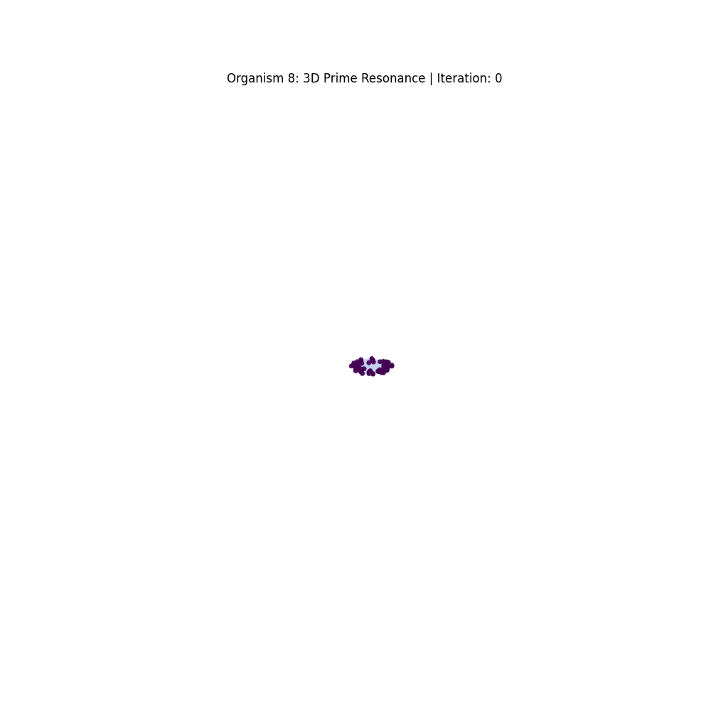

# Organism 8: Prime Attractor Morphodynamics

**ORGANISM 8: AUTOPOIETIC MORPHODYNAMIC SWARM**

* **100% Emergent Autopoiesis:** Zero artificial neural networks, zero reinforcement learning, zero predefined optimization goals.
* **Absolute Stateless Cognition:** No backpropagation, no weight matrices, no memory storage. Pure real-time phase-space synchronization.
* **Prime Number Gravitational Attractors:** Divisor-count topology acts as the sole energetic gradient for zero-entropy morphological crystallization. 
* **Cross-Generational Symbiosis:** Spontaneous network formation, localized metabolic death, and talent-transfer reincarnation without central control.
* **Extreme Computational Velocity:** Pure trigonometric physics evaluating millions of phase states per second on a single standard CPU.

**[ THE UNIVERSAL DATA SOCKET ]**
This is not a closed simulation; it is an open metabolic engine. Feed the `EXTERNAL_DATA_STREAM` any high-entropy data—raw text hashes, market ticks, noise. Watch a unique digital society spontaneously self-assemble, build a symbiotic web, and evolve entirely from the raw entropy of your inputs.

*Run the physics. Watch the emergence.*
